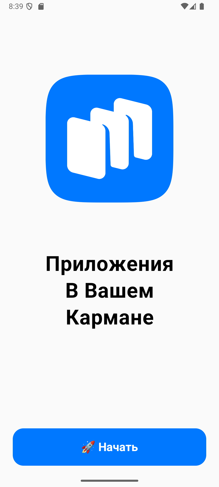
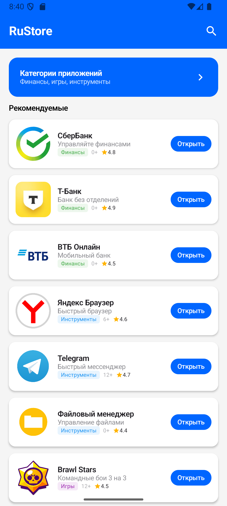
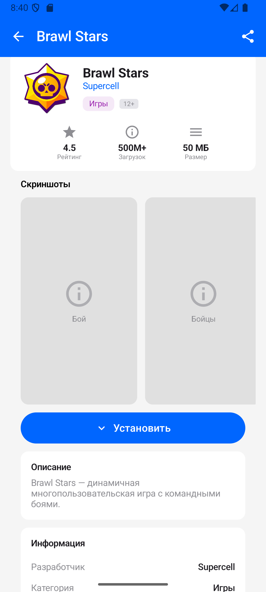

# 🏪 RuStore Client

Клиентское Android-приложение для каталога мобильных приложений, разработанное с использованием Jetpack Compose.

---

## 📱 Скриншоты

  
  
  

---

## 📱 Ссылка на облако с демонстрацией приложения
https://cloud.mail.ru/public/mZ8P/6Hdg4QYYW
---

## 🎯 О проекте

RuStore Client — это современное Android-приложение, представляющее собой каталог мобильных приложений с возможностью просмотра, поиска и фильтрации по категориям. Приложение разработано в рамках учебного проекта с использованием современных технологий и лучших практик Android-разработки.

---

## ✨ Функциональность

| Функция | Описание |
|---------|----------|
| **Онбординг** | Приветственный экран, показывается только при первом запуске приложения. Содержит логотип, приветственный текст и кнопку перехода к витрине |
| **Витрина приложений** | Главный экран со списком всех приложений. Отображает иконку, название, краткое описание, категорию и рейтинг |
| **Категории** | Экран со списком категорий: Финансы, Инструменты, Игры, Государственные, Транспорт. Показывает количество приложений в каждой категории |
| **Поиск** | Интерактивный поиск по названию, описанию и разработчику с автоматическим открытием клавиатуры |
| **Карточка приложения** | Детальная информация: иконка, название, разработчик, категория, возрастной рейтинг, скриншоты, описание, статистика |
| **Просмотрщик скриншотов** | Полноэкранный просмотр с горизонтальной прокруткой и индикаторами |

### 🔹 Общие требования (реализовано)

| Требование | Статус |
|------------|--------|
| Обработка ошибок | ✅ Реализован экран ошибки с возможностью повтора |
| Pull-to-Refresh | ✅ Реализован на всех экранах со списками |
| Состояние загрузки | ✅ CircularProgressIndicator на всех экранах |
| Пустые данные | ✅ Специальный экран для пустых результатов |

---

## 🛠 Технологии

### Основной стек

- **Kotlin** — основной язык разработки
- **Jetpack Compose** — современный декларативный UI toolkit
- **Material Design 3** — система дизайна
- **Navigation Compose** — навигация между экранами

## 🚀 Сборка и запуск

### Требования

- Android Studio Hedgehog (2023.1.1) или выше
- JDK 17+
- Android SDK 34+
- MinSDK 24 (Android 7.0)

### Шаги сборки

1. Клонировать репозиторий
git clone https://github.com/username/rustore-client.git
cd rustore-client

2. Открыть в Android Studio
File → Open → выбрать папку проекта

3. Синхронизировать Gradle
Android Studio предложит это автоматически

4. Запустить на эмуляторе или устройстве
Run → Run 'app' или Shift+F10

### Или

1. Скачать APK из раздела Releases на Android смартфон
